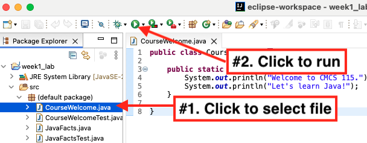

# CMSC 115 Week 1 Lab

## Learning Objectives

- Run a Java application 
- Run a Junit test 
- Modify a Java class
- Fix common syntax errors

## Introduction

...

## Setup

....


## Task 1 - CourseWelcome.java


The  Package Explorer displays a lab project for each week.

 

Expand the `week1_lab > src > default package` folders to view the files in the default package:

 

Double click on `CourseWelcome.java` to open the file in the editor window.


A Java class with a `main` method represents an executable program.  The `main` method
is automatically called when you run the program.

```java
public class CourseWelcome {

    public static void main(String[] args) {
        System.out.println("Welcome to CMCS 115.");
        System.out.println("Let's learn Java!");
    }
}
```

When the `main` method executes, the two print statements produce the following output:

```text
 Welcome to CMSC 115
 Let's learn Java!
 ```


Let's execute the program and view the output.  

1. Click `CourseWelcome.java` in the Package Explorer to select the file.
2. Click the green triangular run button on the workbench toolbar. 

3. View the program output in the console window.


Sometimes a program has an error and fails to produce the expected output.   It is important to thoroughly test every Java class to find and fix bugs. [Junit](https://junit.org/junit5/) is a popular Java testing framework. For each regular Java class, we use a separate Junit  class to test the functionality.

- Java class `CourseWelcome`
- Junit test class `CourseWelcomeTest`

Don't worry about understanding the code in `CourseWelcomeTest`.  We'll learn how to write Junit tests in a later lesson.

Let's practice running a Junit test:

1. Click on `CourseWelcomeTest.java`, then click on the green run button.

2.  The test runs the `main` method in `CourseWelcome`, then compares the actual output to the expected output. The Junit window appears with a green bar to indicate the test was successful.  

3. You can close the Junit window after verifying the test passed.

## Task 2 - JavaFacts.java


Double click on `JavaFacts.java` in the Package Explorer to open the file in the editor. 

```java
public class JavaFacts {

    public static void main(String[] args) {
        System.out.println("Java was initially named Oak.");
        System.out.println("Java is a language.");
    }
    
}
```

Assume `JavaFacts` should produce the expected output displayed below.  


|Expected Output|Actual Output|
|----|----|
|Java was initially named Oak.<br>Java is an object-oriented language.|Java was initially named Oak.<br>Java is a language.|

1. Click on `JavaFacts.java`, then click the run button to view the output.  Notice the program does not produce the expected output.
2. Click on the Junit class `JavaFactsTest.java`, then click the run button to run the test.  The red bar indicates the test failed.


Junit provides a popup window to compare the actual and expected test results:

1. Expand and click on the failed test.
2. Click the "Compare Actual With Expected Test Result" icon.
3. View the difference in the popup window.

 
Let's fix `JavaFacts` to produce the expected output. 

1. Edit the second  statement in the `main` method to print the character string "Java is an object-oriented language".  
2. Run `JavaFacts` and view the output in the console.
3. Run `JavaFactsTest` and confirm your solution passes the test.

Save your changes to `JavaFacts.java` by selecting `File > Save` from the menu bar, or type `Ctrl-S` (Windows/Linux) or `Command-S` (Mac).

After saving, close the file by clicking the `X` on the editor window tab.

 


## Task 3 - Comments.java

Java comments can be used to help explain the code.  A comment can also prevent one or more lines of code from executing.  

- Line comment:  Text following `//` is ignored.
- Block or multi-line comment: Text between `/*`  and `*/` is ignored. 

Double click on `Comments.java` in the Package Explorer to open the file in the editor, then run the program to view the output.

```java
public class Comments {

	public static void main(String[] args) {

		System.out.println("apple"); 

		//System.out.println("orange");

		System.out.println("pear");  //End of line comment

		/*
		System.out.println("lemon");
		System.out.println("banana");
		 */

		System.out.println("watermelon");

		System.out.println("peach"); 
	}
}

```


|Expected Output|Actual Output|
|----|----|
|apple<br>pear<br>watermelon<br><br>|apple<br>pear<br>watermelon<br>peach|

- The print statements for "orange", "lemon", and "banana" are commented out and do not execute.  
- The print statement for "pear" executes since `//` is placed *after* the statement.  

Notice the expected output does not include "peach".  Let's fix the program to produce the expected output:

1. Add `//` to comment out the last print statement (don't delete it!).
2. Run `Comments` to view the output.
3. Run `CommentsTest` to confirm your solution passes the Junit test.  

Save and close any open files.

## Task 4 - Fixit.java

Double click on `Fixit.java` in the Package Explorer to open the file in the editor.   

```java
public class Fixit {
   
   public static void main(String[] args) {
      System.out.println("ship");
      //System.out.println("airplane")
      System.out.println("tank");
   }
   
}
```


|Expected Output|Actual Output|
|----|----|
|ship<br>airplane<br>tank|ship<br>tank<br><br>|


Run the program to view the output.  The second print statement is commented out so the program does not produce the expected output.

1. Remove the comment characters `//` from the second print statement.
2. Try to run the program. A warning message appears indicating an error in the code.  Click "Proceed" to try to execute it anyway.

3. The program fails to run. The error message indicates line 5 is missing a semicolon. 

4. Notice the editor window also displays red warning symbols on line 5. Hover the mouse over either warning symbol to view the error message.


Every statement in the `main` method must end with a semicolon.  Let's fix the syntax error so the program can execute.

1. Add a semicolon to the end of line 5.
2. Run `Fixit` to view the output.
3. Run `FixitTest` to confirm your solution passes the Junit test.  

Save and close any open files.

## Task 5 - Printing.java

Double click on `Printing.java` in the Package Explorer to open the file in the editor.   

```java
public class Printing {

	public static void main(String[] args) {
		System.out.println("red ");
		System.out.print("green ");	
		System.out.println("blue ");	
		System.out.print("pink ");	
		System.out.println("yellow");	
	}

}
```

- `System.out.println`: Appends a newline character. Subsequent output appears on the next line.	
- `System.out.print` : Does not append a newline character. Subsequent output appears on the same line. 

<table>
<tr>
<th>Expected Output</th>
<th>Actual Output</th>
</tr>
<tr>
<td>red <br>green blue <br>pink <br>yellow</td>
<td>red <br>green blue <br>pink yellow<br><br></td>
</tr>
</table>

Run the program to view the output.  In the expected output, "yellow" appears on a separate line from "pink".  Let's fix the program to produce the expected output:

1. Adjust the statement `System.out.print("pink ");` so a newline character is appended after printing "pink". 
2. Run `Printing` to view the output.
3. Run `PrintingTest` to confirm your solution passes the Junit test.  

Save and close any open files.
 


## Task 6 - MathematicalExpression.java

Double click on `MathematicalExpression.java` in the Package Explorer to open the file in the editor.  


```java
public class MathematicalExpression {
	
	public static void main(String[] args) {
		System.out.print("5 + 7 = ");   //5 + 7 =
		System.out.println(5 + 7);        //12
	}

}
```

Run the program and confirm the output as shown below:

```text
5 + 7 = 12
```


A `String` is a sequence of characters surrounded by double quotes.  An unquoted arithmetic expression evaluates to a numeric value. 

<table>
<tr>
<td>Expression</td><td>Value</td>
</tr>
<tr>
<td>"5 + 7 = "</td><td>"5 + 7 = "</td>
</tr>
<tr>
<td>5 + 7</td><td>12</td>
</tr>
</table>


<table>
<tr>
<th>Expected Output</th>
<th>Actual Output</th>
</tr>
<tr>
<td>(2 + 3) * 8 = 40</td>
<td>2 + 3 * 8 = 26</td>
</tr>
</table>

1. Adjust the 2 print statements to produce the expected output, adding parenthesis to both the string and the mathematical expression.  
2. Run `MathematicalExpression` to view the output.
3. Run `MathematicalExpressionTest` to confirm your solution passes the Junit test.  

Save and close any open files.
 

## Task 7 - SelfIntroduction.java

Double click on `SelfIntroduction.java` in the Package Explorer to open the file in the editor.   

```java

public class SelfIntroduction {

	public static void main(String[] args) {
		// TODO: Introduce yourself with at least 4 lines of output.
		System.out.println("My name is ...");
	}

}
```

1. Edit the `main` method to add print statements to introduce yourself. The program should produce at least 4 lines of output.
2. Run  `SelfIntroductionTest` to confirm your solution passes the Junit test, which is designed to count the number of lines of output.

Save and close any open files.

## Submit Your Solution

If there are any open files in the editor window, right-click on one of the tabs and select "Close All". You will be prompted if there are any unsaved changes. **Save your changes before submitting.**


.....TBD.....
